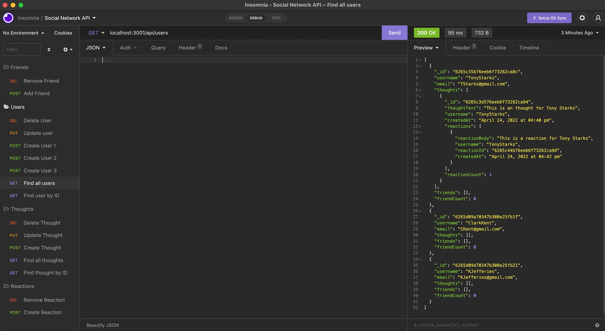

# social-network-api

----
## Table of Content

- [Description](#description)
- [Objectives](#objectives)
- [Usage](#usage)
- [Media](#media)
- [GitHub Repository](#github-repository)
- [Authors](#authors)  
- [Contributors and Reference Sources](#contributors-and-reference-sources)
- [Technologies Used](#technologies-used) 
- [License](#license)

-------
## Description:  

The Social-Network-API is a social network web application where users can share their thoughts, react to friends’ thoughts, and create a friend list.  The routes will all be tested via Insomnia.  The route test import file is located within the repo, under 'Insomnia-Routes.json'.

------
## Objectives:

```
- GET: 
    * All Users
    * User by ID
    * All Thoughts
    * Thought by ID
- POST:
    * Create User
    * Create Thought
    * Create reaction
    * Create Friend (Add friend to users list)
- PUT:
    * Update User
    * Update Thought
- DELETE:
    * Delete User
    * Delete Thought
    * Delete Reaction
    * Delete Friend (Remove friend from users list)
- BONUS:
    * When User is deleted, the associated Thoughts are also deleted.
```

------
## Usage:

- lone repository from Github acccount listed below
- Open Integrated Terminal from 'package.json
- Run the following from the terminal prompt
    * 'npm install'
    * 'node server.js'
- Run Insomnia 
    * Import test routes from file: 'Insomnia_Routes.json' into Insomnia

------
## Media:



[Video of all routes being tested in Insomnia](https://drive.google.com/file/d/1u10o8Mgsn-1FTEjgULUJqgj5CXI5wqv6/view?usp=sharing)

## Github Repository:

- [Github Repository for Social Network API](https://github.com/ksjefferies/social-network-api)

## Author:

- [Kelly Jefferies](https://github.com/ksjefferies)

## Contributors and Reference Sources:

- [Stackoverflow: Mongoose email validation](https://stackoverflow.com/questions/18022365/mongoose-validate-email-syntax)
- [Moment.js Date/Time Formatting](https://momentjscom.readthedocs.io/en/latest/moment/04-displaying/01-format/)
- [Wikipedia: HTTP Error status codes](https://en.wikipedia.org/wiki/List_of_HTTP_status_codes)
- In-Class Lesson 18, Section 25
- Daniel Norred
- Jake Kelly

## Technologies Used:


## License:

[](http://choosealicense.com/licenses/mit/)